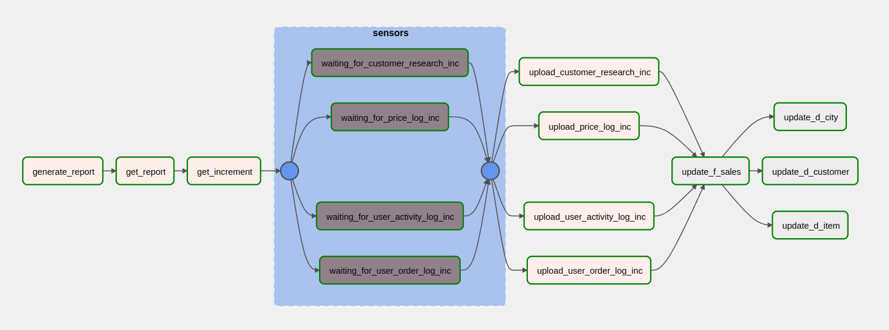
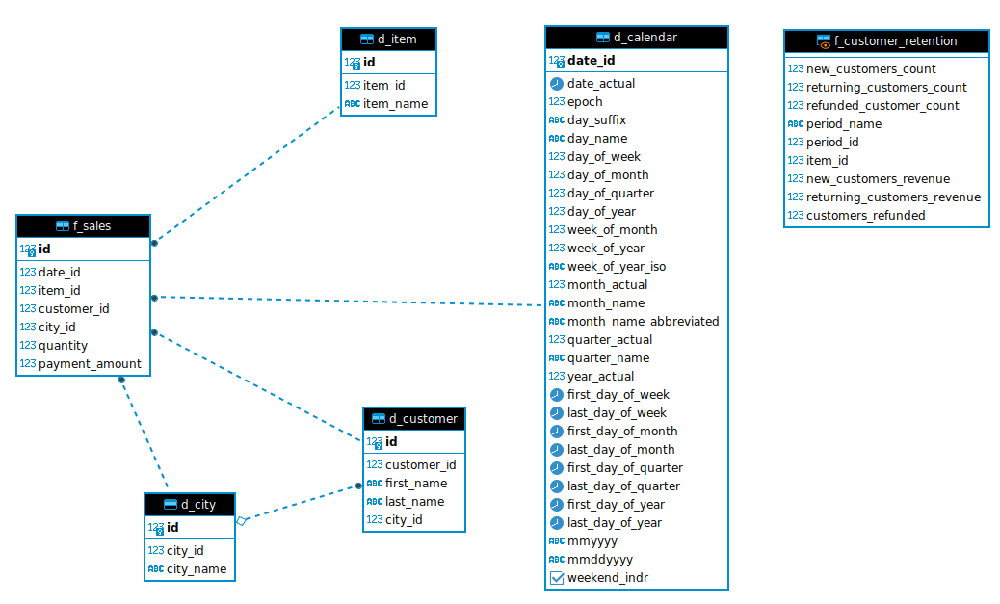

# ETL для загрузки инкрементальных данных
### Стэк:
- Python 3.10
- Airflow  2.2.5
- PostgreSQL

### Задачи: 
- ежедневно получать данные по продажам по API;
- загружать данные в stage, учитывая что в данных могут быть изменения и дубликаты;
- обеспечить возможность перезапуска пайплайна в случае необходимости;
- обновлять витрину с данными о продажах;
- создать в слое витрин данных представление с показателями для расчет retention.

### Описание этапов пайплайна: 

#### 1. Получение данных по API
##### generate_report
Отправляется запрос на создание отчета. API возвращает параметр `task_id`, который записывается в xcom.

##### get_report
Каждые 10 секунд запрашивается статус задачи по `task_id`. Если статус = 'SUCCESS', API возвращает параметр `report_id`, который записывается в xcom.

##### get_increment
Отправляется запрос с параметром `report_id` на получение данных за текущую дату. Файлы сохраняются в локальном хранилище. 

##### sensors
С помощью `FileSensor` проверяется наличие всех файлов. Если какой-то из файлов не был найден, процесс загрузки данных останавливается. 

#### 2. Загрузка данных в staging-слой
##### upload_inc_data_to_staging
Из локального хранилища данные переносятся в staging-слой базы данных. 
В процессе загрузки: 
- из файлов удаляются дубликаты;
- для таблицы `user_order_log_inc` реализовано получение данных по новому параметру 'status'. Также обрабатывается случай, когда данные могут поступать без этого параметра;
- реализована возможность перезапуска пайплайна без появления дубликатов.

#### 3. Создание витрины данных
На основе данных из staging-cлоя создается витрина данных, которая содержит следующие таблицы: 
d_city - справочник по городам
d_customer - данные о клиентах
d_item - данные о товарах 
f_sales - данные о продажах 

##### update_f_sales
Обновляются данные в таблице фактов f_sales. В данных о продажах, которые поступают по API в файле `user_order_log_inc.csv` могут быть 2 статуса:
- shipped (товар был доставлен и оплачен);
- refunded (товар был возвращен пользователем, пользователю вернулись деньги в размере стоимости товара)

Для корректного расчета метрики `total_revenue` в строки со статусом `refunded` стоимость добавляется со знаком -.

##### update_d_item
Обновляются данные в таблице измерений d_item. В таблицу добавляются только новые данные. 

##### update_d_customer
Обновляются данные в таблице измерений d_customer. В качестве города для каждого клиента добавляется город последнего заказа.
Данные загружаются отдельно для новых клиентов (информации о которых ранее не было в БД) и вернувшихся. Для вернувшихся клиентов обновляется информация о городе. 

##### update_d_city
Обновляются данные в таблице измерений d_city. В таблицу добавляются только новые данные. 

#### Cхема ETL

#### 4. Создание представления для расчета retention
Витрина содержит следующую информацию: 
- Рассматриваемый период — weekly.
- Возвращаемость клиентов:
    - new — кол-во клиентов, которые оформили один заказ за рассматриваемый период;
    - returning — кол-во клиентов, которые оформили более одного заказа за рассматриваемый период;
    - refunded — кол-во клиентов, которые вернули заказ за рассматриваемый период.
- Доход (revenue) и refunded для каждой категории покупателей.

Код для витрины находится в папке /migrations/mart.f_customer_retention.sql

#### Cхема cлоя витрин в БД

